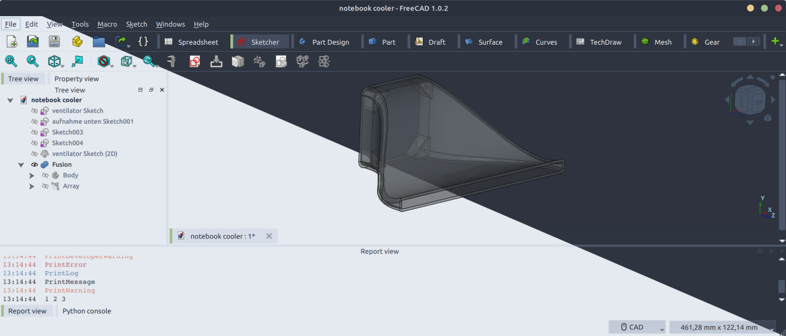
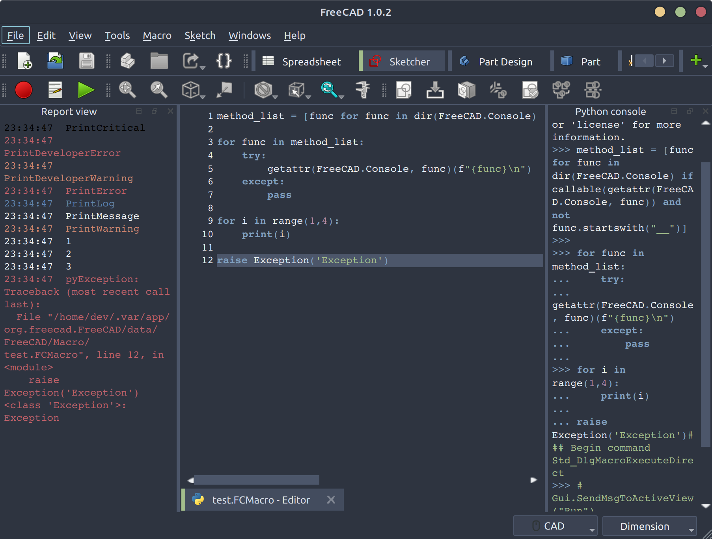

# A Nordic Theme and Preference Pack

This pack contains a dark and a light theme to fit the [Nord](https://nordtheme.com) colour palette as well as a set of preferences.  
Preferences activate and group panels and arrange workbeches. Themes and preferences work independently, you can use either or both.

After installation you can select and apply your preferred theme NorthernLights or NorthernNights within `Preferences > General`.  
Be aware that applying the NordicPreferences alters your UI arrangement, make sure to back up current settings when in doubt.

## Screenshots

This theme is likely not matching accessibility requirements regarding contrast.

### Bug/Feedback

Please report bugs to the [issue queue](https://github.com/erroronline1/NordicFC/issues) and ping the [dedicated NordicFC FreeCAD forum thread](https://forum.freecad.org/viewtopic.php?p=848525#p848525) to discuss said issue or feedback in general. 