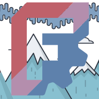
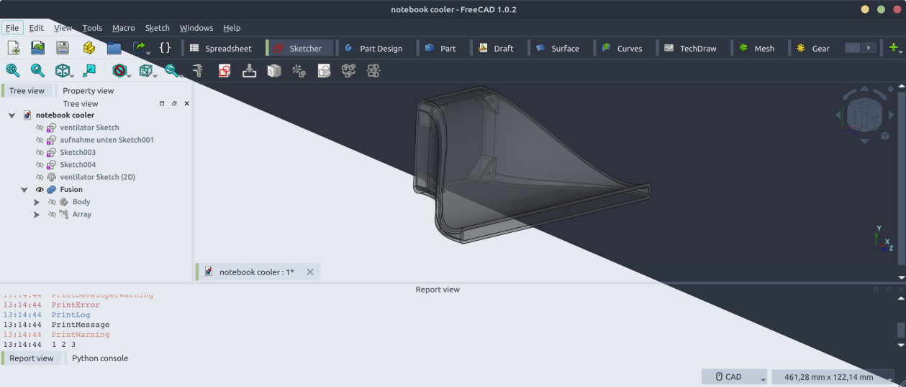
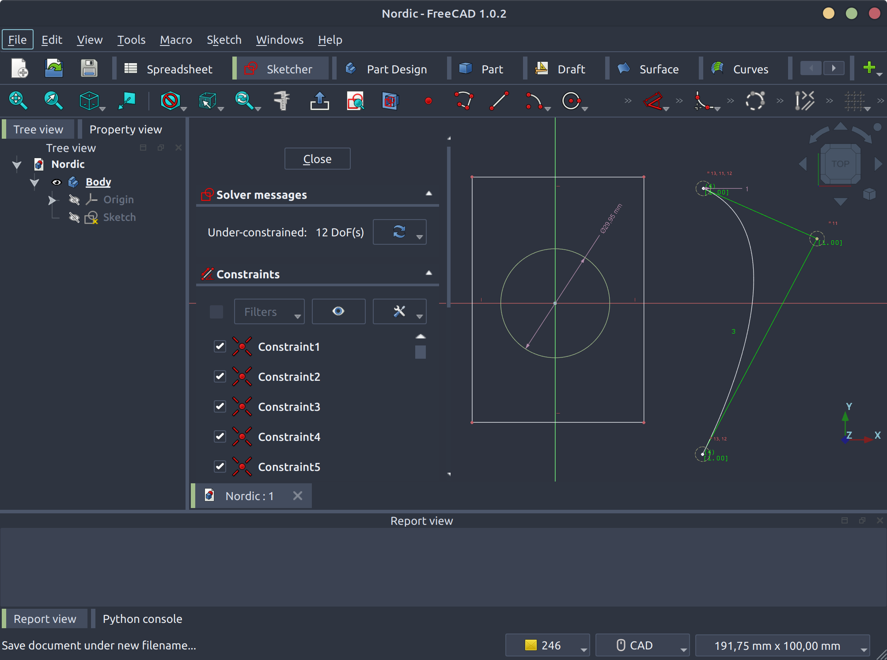
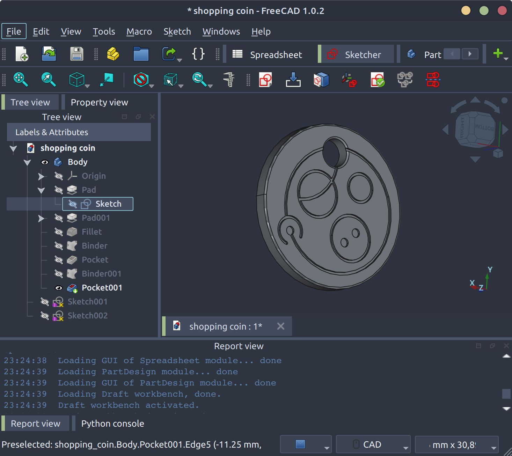
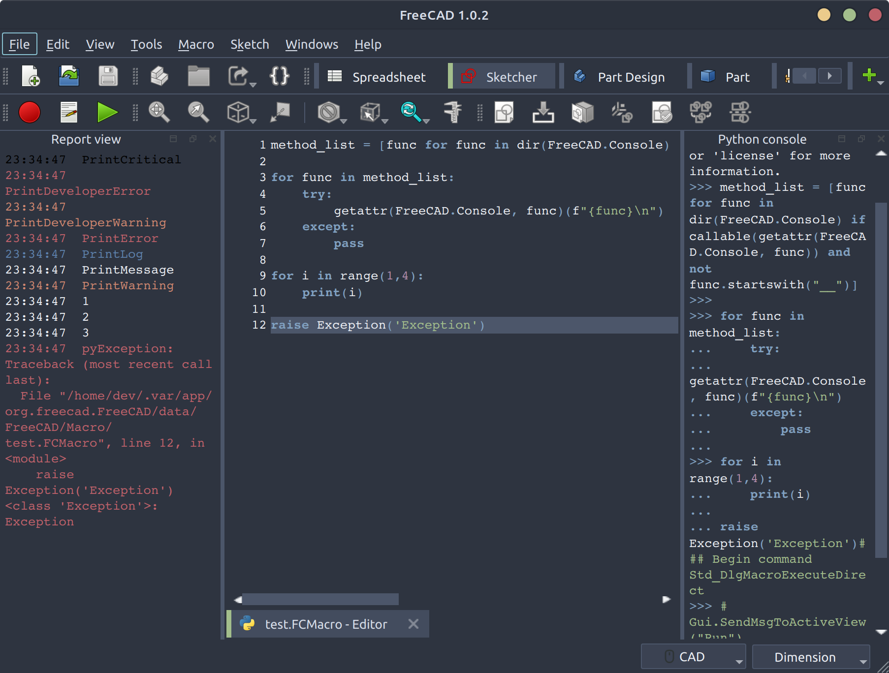

# A Nordic Theme and Preference Pack

This pack contains a dark and a light theme to fit the [Nord](https://nordtheme.com) colour palette as well as a set of preferences.  
Preferences activate and group panels and arrange workbeches. Themes and preferences work independently, you can use either or both.

After installation you can select and apply your preferred theme NorthernLights or NorthernNights within `Preferences > General`.  
Be aware that applying the NordicPreferences alters your UI arrangement, make sure to back up current settings when in doubt.

### Version compatibility

<details>
<summary>Confirmed latest stable FreeCad version 1.0 - Expand for more</summary>

* 1.1rc
* 1.0

Older versions have not been tested and can therefore not be confirmed

</details>

### Version update
* 1.0.1
    * dark font on bright tooltips
    * fixed overlay 

## Screenshots






This theme is likely not matching accessibility requirements regarding contrast.

## Installation
As long as the preference pack is not available in the addon manager you can add it to the custom repositories within `Preferences > Addon Manager Options` with the repository url `https://github.com/erroronline1/NordicFC` and `main` branch. Also if you're going to tinker your own.
> Using [Preference Packs](https://wiki.freecad.org/Preference_Packs) requires FreeCAD 0.20 or higher.
> 
> Preference Packs should be installed via the [Addon Manager](https://github.com/FreeCAD/FreeCAD-addons) once available, but can be [installed manually](https://wiki.freecad.org/Preference_Packs#Distributing_a_pack) if required.

There ar no further dependencies.

### Bug/Feedback

Please report bugs to the [issue queue](https://github.com/erroronline1/NordicFC/issues) and ping the [dedicated NordicFC FreeCAD forum thread](https://forum.freecad.org/viewtopic.php?p=848525#p848525) to discuss said issue or feedback in general.   

## Adapting
The work is based on [OpenTheme](https://github.com/obelisk79/OpenTheme). **Major** work has been done by these fellows, I primarily adjusted colours and some stylings because I have been in desperate need of a nordic theme for *years*.

> To build SCSS sources into QSS files you will need to have qtsass installed: [spyder-ide/qtsass](https://github.com/spyder-ide/qtsass).  
> Once you have it you should modify ONLY `.scss` files and rebuild them using `build.sh` script.  
> To watch files for changes and rebuild stylesheets automatically you can use `--watch` flag:
> ```bash
> ./build.sh --watch
> ```

### The more you know:
On customizing the package names, directory- and filenames of qss- and cfg-files must be the same!  
The colour values in the cfg files are decimal representations of rgba hex codes and can be converted easily [here](https://www.rapidtables.com/convert/number/hex-to-decimal.html)  

On the way I figured recent settings to be extractable from `~/.var/app/org.freecad.FreeCAD/config/FreeCAD/user.cfg` (Flatpack installation on Mint 21.3).

I tried to mark the styleable items as far as I was able to for the next guy. Respective comments can be found within `scss/OpenDark.scss` from where you can search for elements with the same name in the other files. 

## License
acknowledging the original license: [LGPLv2](https://en.m.wikipedia.org/wiki/GNU_Lesser_General_Public_License)
