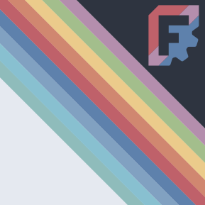

# A Nordic Theme and Preference Pack

Based on [OpenTheme](https://github.com/obelisk79/OpenTheme), matched to fit the [Nord](https://nordtheme.com) colour palette.

To be fair, **major** work has been done by these fellows, I primarily adjusted colours and some stylings because I have been in desparate need of a nordic theme for *years*.

This pack contains a dark and a light theme as well as preference settings. This theme is likely not matching accessibility requirements regarding contrast.

## Installation
> Using [Preference Packs](https://wiki.freecad.org/Preference_Packs) requires FreeCAD 0.20 or higher.
> 
> Preference Packs should be installed via the [Addon Manager](https://github.com/FreeCAD/FreeCAD-addons), but can be [installed manually](https://wiki.freecad.org/Preference_Packs#Distributing_a_pack) if required.
> 

## Screenshots


## Adapting
> To build SCSS sources into QSS files you will need to have qtsass installed: [spyder-ide/qtsass](https://github.com/spyder-ide/qtsass).  
> Once you have it you should modify ONLY `.scss` files and rebuild them using `build.sh` script.  
> To watch files for changes and rebuild stylesheets automatically you can use `--watch` flag:
> ```bash
> ./build.sh --watch
> ```

### The more you know:
On customizing the package names, directory- and filenames of qss- and cfg-files must be the same!

## License
acknowledging the original license: [LGPLv2](https://en.m.wikipedia.org/wiki/GNU_Lesser_General_Public_License)
